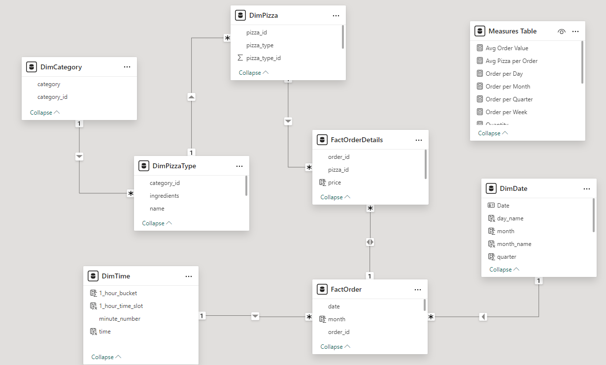
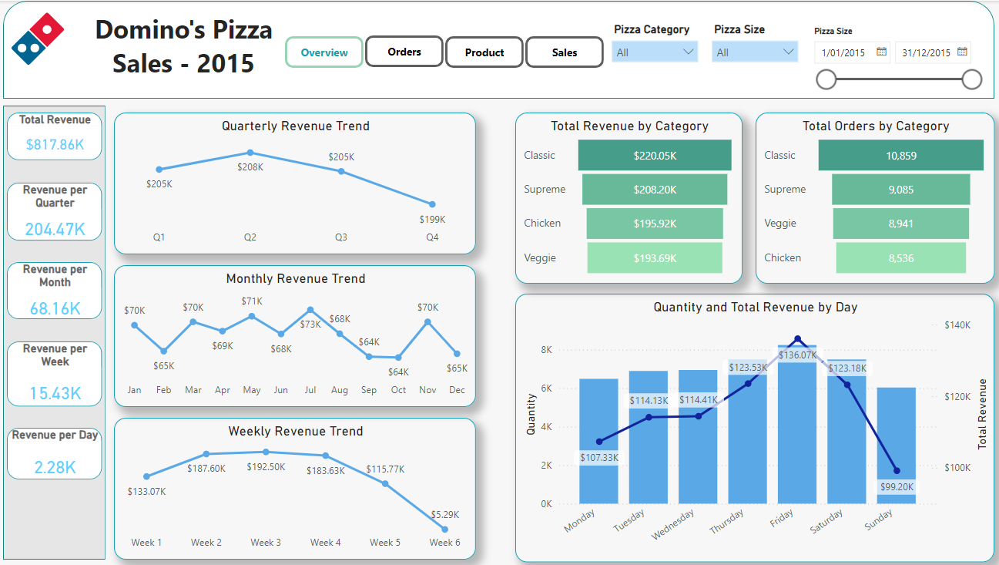
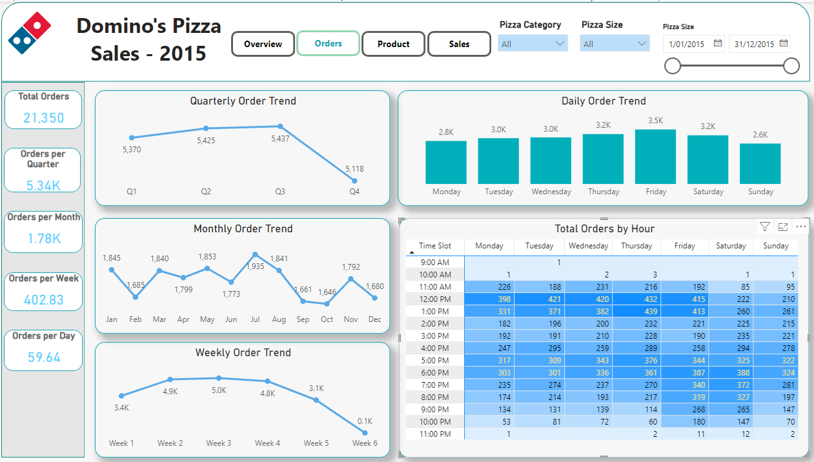
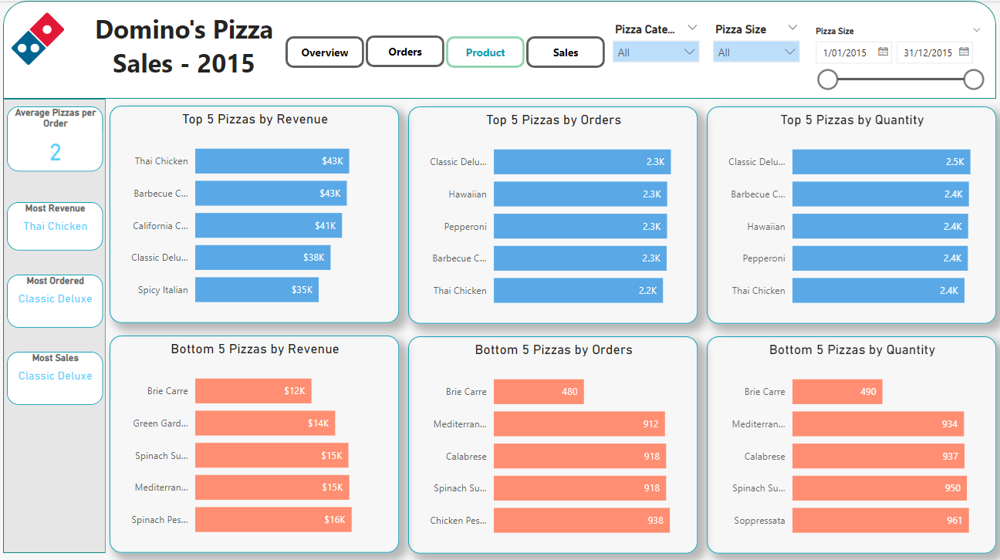
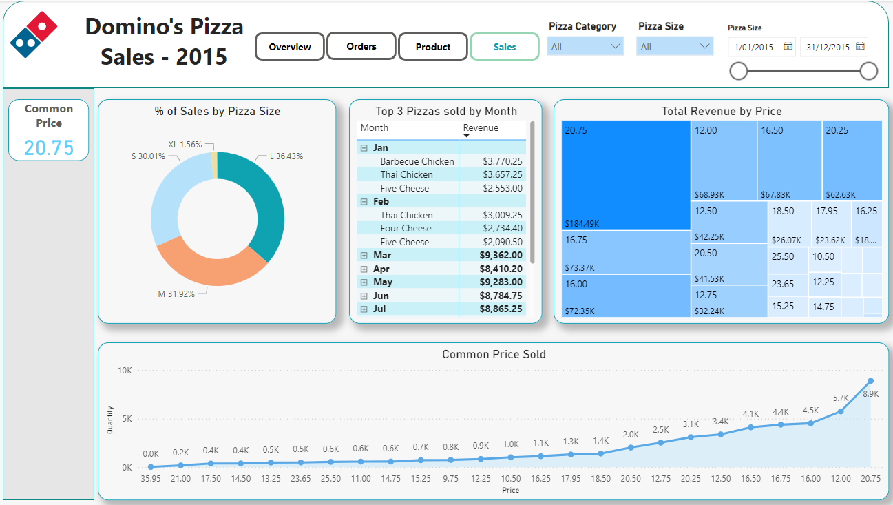

# Pizza Domino's Analysis

## Overview
This project provides in-depth insights into pizza sales data, including quarterly, monthly, daily, and hourly trends, sales by pizza category and size, and identifying top-selling pizzas based on revenue, quantity, and total orders. This analysis aids the company in understanding customer behavior, enabling better data-driven business decisions for future expansion and increased revenues. The dataset includes order details in 2015, with information on the date and time orders were placed, and the quantity ordered for each pizza type and size.

Link to **[interactive report](https://app.powerbi.com/view?r=eyJrIjoiMTQ3ZmM5NGEtYTQ5ZC00NmQwLWE0MWMtZGE1MmFmZjQzMmM2IiwidCI6Ijg1NzQ0OTQ5LTgyNzctNDBmOS05ZDAyLTAyOTZiNjI0YjhjOCJ9)**

## Project Goals
- What are the revenue trends over time (daily, weekly, monthly, quarterly, annually) from pizza sales?
- Which type of pizza generates the highest and lowest revenue?
- Which pizza size is most preferred by customers?
- What time of day do we see the highest number of orders?
- Is there a seasonal pattern to the ordering behavior (for example, summer versus winter)?
- Which pizzas with what ingredients are the bestsellers?
- How many types of pizzas are there in each category, and which category is the most popular?
- Which type of pizza has the highest order quantity per transaction?
- Is there a difference in quantity and revenue among the days of the week?
- Which price point is most common, and is there a correlation between price and quantity sold?
- How does price diversity affect revenue?
- Are there any increasing or decreasing trends in the number of orders?

## Data Transformation
The data from the dataset was organised into 5 separate tables to facilitate analysis:
- **Category**: Contains the category ID and category name.
- **PizzaType**: Contains the pizza type ID, pizza type, pizza type name, category ID and ingredients.
- **Pizza**: Contains the pizza ID, size, price, pizza type, and pizza type ID.
- **Order**: Contains the order ID, order date and time.
- **OrderDetails**: Contains the order ID, pizza ID, and quantity.

## Data Modelling

## Dashboard Overview
The Pizza Sales Report provide a user-friendly interface and offer the following views:

### Overview Dashboard
- The total revenue increased from quarter 1 to quarter 2 with the top peak at $208K and decreased significantly in quarter 4. February, September, October, and December had the lowest revenue compared to other months. Revenue remained stable in weeks 2, 3, and 4, but showed a decline in week 1. Due to the calendar's limited data for weeks 5 and 6, revenue in these weeks is much lower than in other weeks. Friday had the highest revenue at $136.07K, followed by Thursday and Saturday. Sunday had the lowest revenue at $99.20K.
- The Classic category is the most popular in terms of orders and generates the highest revenue.

### Orders Dashboard
- Total orders increased from quarter 1 to quarter 3, with a dramatic decrease in quarter 4. Orders peaked in July with 1,935. Similar to revenue, the number of orders remained stable in weeks 2, 3, and 4, but showed a decline in week 1. Customers placed the most orders on Fridays.
- The highest number of orders occurred between 12 PM and 1 PM from Monday to Friday, and between 5 PM and 6 PM from Monday to Sunday.

### Product Dashboard
- The Thai Chicken pizza contributed the most to the increase in total revenue. Additionally, the Classic Deluxe was the best seller and the most frequently ordered. In contrast, the Brie Carre was the least ordered and sold pizza.

### Sales Dashboard
- The large size of pizza was the most preferred by customers.
- The common price as $20.75 contributed the most in total revenue and total sales.

